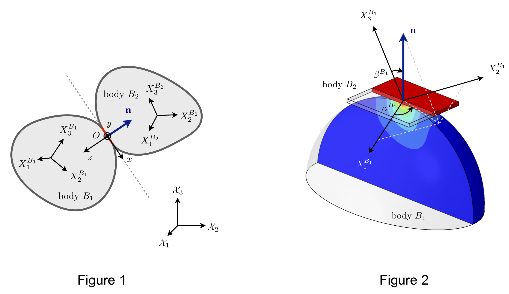

# AnisotropicGrains

This code accompanies the paper [Contact model for elastically anisotropic bodies and efficient implementation into the discrete-element method](https://arxiv.org/abs/2006.13148) by Mowlavi & Kamrin (2020)

Given two elastically anisotropic bodies of arbitrary shape contacting at a single point (see Figure 1), we provide a contact force law that returns the normal force exerted between the two bodies as a function of their orientations, surface geometries and elastic constants, as well as the direction of contact and overlap distance.

## Main files

* **compute_force** computes the force between two elastic bodies (see Figure 1) for a given orientation of the bodies and contact normal direction.
* **compute_pole_plot** computes the force between a rigid plate and an elastic body (see Figure 2) for all possible orientations of the contact normal and displays the resulting orientation-dependence of the force in a pole plot.

