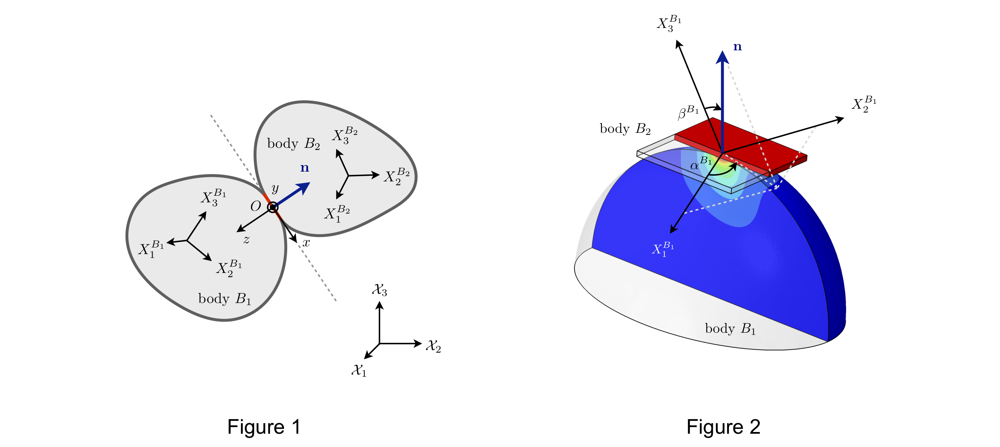

# AnisotropicGrains

This code accompanies the paper "Contact model for elastically anisotropic bodies and efficient implementation into the discrete-element method" by Mowlavi & Kamrin (2020)

Given two elastically anisotropic bodies of arbitrary shape contacting at a single point (see Figure 1), we provide a contact force law that returns the normal force exerted between the two bodies as a function of their orientations and elastic constants, as well as the direction of contact and overlap distance.

